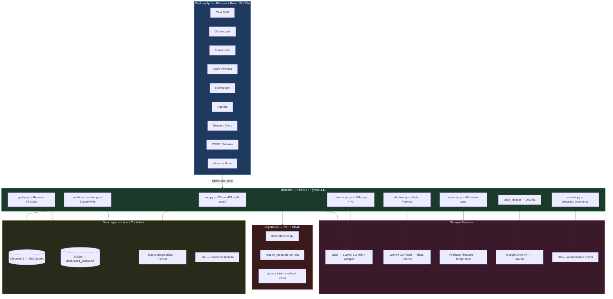

<div align="center">

[](https://github.com/patrese-procopio/agent-bastos/actions/workflows/ci.yml)
[](https://www.python.org/)
[](https://fastapi.tiangolo.com/)
[](https://www.docker.com/)
[](LICENSE)

```
  █████╗  ██████╗ ███████╗███╗   ██╗████████╗    ██████╗  █████╗ ███████╗████████╗ ██████╗ ███████╗
 ██╔══██╗██╔════╝ ██╔════╝████╗  ██║╚══██╔══╝    ██╔══██╗██╔══██╗██╔════╝╚══██╔══╝██╔═══██╗██╔════╝
 ███████║██║  ███╗█████╗  ██╔██╗ ██║   ██║       ██████╔╝███████║███████╗   ██║   ██║   ██║███████╗
 ██╔══██║██║   ██║██╔══╝  ██║╚██╗██║   ██║       ██╔══██╗██╔══██║╚════██║   ██║   ██║   ██║╚════██║
 ██║  ██║╚██████╔╝███████╗██║ ╚████║   ██║       ██████╔╝██║  ██║███████║   ██║   ╚██████╔╝███████║
 ╚═╝  ╚═╝ ╚═════╝ ╚══════╝╚═╝  ╚═══╝  ╚═╝       ╚═════╝ ╚═╝  ╚═╝╚══════╝  ╚═╝    ╚═════╝ ╚══════╝
```

### Sistema de Inteligência Corporativa com IA — Segurança Pública e Empresarial

<br/>

[](https://python.org)
[](https://fastapi.tiangolo.com)
[](https://www.electronjs.org)
[](https://trychroma.com)
[](https://groq.com)
[](https://ai.google.dev)
[](https://firebase.google.com)
[](https://www.gov.br/cidadania/lgpd)
[](https://docs.ragas.io)
[]()

<br/>

> **Plataforma de IA operacional** que transforma dado bruto em conhecimento acionável —
> RAG doutrinário, análise forense de manuscritos, transcrição inteligente de áudio,
> mapeamento de vínculos, monitoramento de fontes abertas e dashboard analítico
> em uma única interface desktop integrada.

<br/>

[🎯 O Problema](#-o-problema-que-resolve) • [✨ Funcionalidades](#-funcionalidades) • [🏗️ Arquitetura](#️-arquitetura) • [🚀 Quick Start](#-quick-start) • [📊 RAGAS](#-avaliação-de-qualidade--ragas) • [📐 ADRs](./ARCHITECTURE.md)

</div>

---

## 🎯 O Problema que Resolve

Equipes de inteligência e segurança corporativa enfrentam gargalos críticos diariamente:

| Problema | Impacto Antes | Solução Agent Bastos |
|---|---|---|
| Consulta manual a doutrinas e políticas dispersas | 2–3h por analista/dia | RAG semântico vetorial — resposta com fonte em segundos |
| Transcrição manual de entrevistas e capturas de campo | 45–90 min por hora de áudio | Pipeline Whisper com Relatório de Informação gerado automaticamente |
| Análise de manuscritos e documentos físicos apreendidos | Processo subjetivo, sem rastreabilidade | Análise forense com Gemini 2.5 Flash + laudo exportável em PDF |
| Mapeamento manual de vínculos entre alvos e grupos | Horas de cruzamento em planilhas | Grafo de vínculos interativo com visualização de rede em tempo real |
| Produção analítica sem visibilidade gerencial | Sem métricas, sem gestão | Dashboard com KPIs por núcleo, analista e tipo de documento |
| Monitoramento de fontes abertas (OSINT) fragmentado | Ferramentas desconexas | Monitor de Telegram, alertas e feeds integrados em um painel único |

---

## 📋 Sobre o Projeto

O **Agent Bastos** é uma plataforma de inteligência corporativa com IA construída sobre uma década de experiência operacional em análise de segurança pública. A arquitetura foi desenhada para ser **agnóstica ao setor** — nasce em inteligência penitenciária, mas é implantável em qualquer organização que produza conhecimento analítico: corporações, escritórios de compliance, unidades investigativas, agências regulatórias.

**Diferenciais técnicos que o distinguem:**

- **Zero alucinação verificada** — Faithfulness 1.000 no benchmark RAGAS, respostas ancoradas exclusivamente no corpus doutrinário indexado
- **Multi-modelo orquestrado** — cada domínio usa o modelo mais adequado: LLaMA 3.3 70B (RAG + análise), Gemini 2.5 Flash (visão forense), Whisper (áudio), Firebase (tempo real)
- **RBAC por módulo** — cada funcionalidade da API é protegida por um guardião de permissão independente via injeção de dependência do FastAPI
- **10 ADRs documentados** — decisões arquiteturais com contexto, trade-offs e resultados mensuráveis. Ver [ARCHITECTURE.md](./ARCHITECTURE.md)
- **LGPD by design** — dados operacionais nunca versionados, laudos gerados localmente, autenticação hierárquica por JWT

---

## ✨ Funcionalidades

> O sistema possui **19 telas funcionais** no frontend desktop (Electron + React 18), cada uma mapeada a um módulo isolado no backend FastAPI.

<details>
<summary><strong>🔍 Consulta Doutrinária com RAG Vetorial</strong></summary>

Consulta semântica sobre bases de conhecimento e doutrinas corporativas via **ChromaDB + multilingual-e5-small**. O agente recupera os chunks mais relevantes por similaridade vetorial e responde fundamentado exclusivamente no conteúdo indexado, sempre referenciando a origem.

- **Faithfulness 1.000** nos testes RAGAS — zero alucinação verificada
- **Answer Relevancy 0.782** / **Context Precision 0.794**
- Painel lateral com fontes, trechos e score de confiança por chunk
- Base de 963 chunks indexados de doutrinas nacionais de inteligência
- Temperatura 0.2 — máxima fidelidade ao corpus, mínima variação

</details>

<details>
<summary><strong>🔬 Análise Grafoscópica de Manuscritos</strong></summary>

Upload de imagens de documentos físicos, bilhetes e registros apreendidos. O **Gemini 2.5 Flash** transcreve com precisão forense (temperatura 0.1), preservando grafia original e identificando codinomes e siglas operacionais.

- Tratamento especializado de cursivo denso e linguagem cifrada
- Identificação automática de codinomes, datas e referências cruzadas
- Campo `confianca` e `requer_revisao_humana` como saída estruturada
- Exportação de laudo forense em `.pdf` gerado **client-side** via jsPDF
- Documento nunca transita por servidor externo — conformidade LGPD

</details>

<details>
<summary><strong>🎙️ Transcrição Forense de Áudio</strong></summary>

Pipeline de transcrição via **Groq Whisper** com geração automática de Relatório de Informação (RI) no padrão institucional.

- Suporte a gravação direta na interface ou upload de arquivo de áudio
- Diarização de speakers com timestamps
- Identificação automática de termos operacionais e flags de risco
- Geração do RI estruturado (Assunto / Dados / Análise / Observações) ao final da transcrição

</details>

<details>
<summary><strong>🕸️ Análise de Vínculos e Redes</strong></summary>

Módulo de grafoscopia relacional — mapeamento visual de vínculos entre alvos, grupos e ocorrências usando teoria de grafos.

- Visualização interativa de rede de vínculos
- Identificação de nós centrais (alta centralidade de intermediação)
- Atualização dinâmica ao adicionar novos alvos ou relações
- Exportação do grafo para análise e anexo em relatórios

</details>

<details>
<summary><strong>📊 Dashboard de Produção Analítica</strong></summary>

Painel gerencial de acompanhamento da produção por núcleo e por analista, com **SQLite** como source of truth local — sem dependência de serviço externo.

- KPIs com indicadores de tendência (▲▼) e comparativo por período
- Gráficos de barras e linha por núcleo (NI, NCI, NBE) e por NUCADI
- Relatório narrativo gerado por LLaMA via endpoint `/relatorio-dashboard`
- Exportação de relatório gerencial em PDF

</details>

<details>
<summary><strong>🗓️ Agenda Operacional em Tempo Real</strong></summary>

Sistema de lançamento e acompanhamento de ordens e missões via **Firebase Firestore**, com sincronização bidirecional entre estações.

- Sincronização em tempo real entre múltiplos clientes
- Notificação automática ao receber nova tarefa
- Histórico de missões por analista e por período
- Acesso hierárquico controlado por nível JWT

</details>

<details>
<summary><strong>🔭 Inteligência de Grupos e Controle de Alvos</strong></summary>

Gestão integrada de grupos de interesse e alvos monitorados, com cruzamento entre perfis, ocorrências e histórico documental.

- Cadastro e gestão de grupos com tipologia e status
- Lista negra de alvos com busca e atualização integrada
- Cruzamento automático com alertas e ocorrências registradas
- Matriz de NUCADIs com visão consolidada por unidade

</details>

<details>
<summary><strong>📡 Monitoramento de Fontes Abertas (OSINT)</strong></summary>

Monitor de fontes abertas integrado a **Telegram** e feeds externos via **n8n**, com processamento automático de alertas.

- Monitoramento de canais e grupos do Telegram por palavras-chave configuráveis
- Feed de notícias com filtragem por relevância operacional
- Sistema de alertas por criticidade com notificação em tempo real
- Integração com workflows n8n para automação de coleta e triagem

</details>

<details>
<summary><strong>🗂️ Busca em Acervo Documental (Google Drive)</strong></summary>

Indexação e consulta do acervo histórico via **Google Drive API + OAuth2**, sem replicar documentos originais — acesso por referência.

- Consulta semântica e por palavra-chave no acervo institucional
- Filtro por tipo de documento, autor e período
- Documentos originais não são copiados localmente — conformidade LGPD
- Ideal para referência cruzada em análises e relatórios

</details>

<details>
<summary><strong>🪪 Lideranças por Unidade</strong></summary>

Módulo de gestão de perfis de lideranças por unidade, com fotos, cargos e histórico vinculado.

- Cadastro de lideranças com foto, função e unidade de lotação
- Busca por nome, cargo ou unidade
- Vinculação com alertas, grupos e ocorrências registradas no sistema

</details>

<details>
<summary><strong>📑 Extrato e Sinais Fracos</strong></summary>

Módulos de análise temporal — extrato consolidado de atividades por período e detecção de sinais fracos em padrões de comportamento.

- Extrato analítico por período, unidade ou analista
- Identificação de padrões recorrentes e sinais fracos em séries de eventos
- Apoio a análises preditivas e relatórios de tendência

</details>

---

## 🏗️ Arquitetura

> Todas as decisões arquiteturais estão documentadas em **[ARCHITECTURE.md](./ARCHITECTURE.md)** com 10 ADRs — contexto, motivação, trade-offs e resultados mensuráveis.



### Evolução da Arquitetura

```
v1.0 — Monólito Desktop        v1.3 — Separação de Camadas     v1.5 — MVP Atual
──────────────────────────     ─────────────────────────────   ──────────────────────────────────
Python + CustomTkinter         FastAPI + React (REST)          Multi-modelo orquestrado
  └─ Tudo acoplado             Ollama local (LLaMA 1b)           ├─ LLaMA 3.3 70B (RAG / análise)
  └─ Ollama local              ChromaDB local                    ├─ Gemini 2.5 Flash (visão forense)
  └─ Sem API                   Módulos isolados                  ├─ Whisper / Groq (áudio)
  └─ Sem autenticação          JWT introduzido                   ├─ Firebase (agenda tempo real)
                                                                 ├─ n8n + Telegram (OSINT)
                                                                 ├─ Electron (desktop app)
                                                                 ├─ RAGAS (benchmark objetivo)
                                                                 └─ LGPD by design
```

### Estrutura dos Repositórios

O projeto é composto por **dois repositórios independentes** que se comunicam via REST:

```
agent-bastos/                        ← Backend Python (este repositório)
│
├── api.py                           ← FastAPI — orquestrador de routers (entrypoint real)
├── avaliar_rag.py                   ← Pipeline RAGAS — benchmark reproduzível
├── iniciar.bat                      ← Sobe backend + n8n + frontend simultaneamente
├── docker-compose.yml               ← Stack completa em containers
├── ARCHITECTURE.md                  ← 10 ADRs com decisões arquiteturais documentadas
│
├── modules/                         ← Lógica de negócio, desacoplada da API
│   ├── rag.py                       ← RAG vetorial — ChromaDB + LLaMA 3.3 70B
│   ├── decifrar.py                  ← Análise grafoscópica — Gemini 2.5 Flash
│   ├── transcricao.py               ← Transcrição forense — Groq Whisper
│   ├── grafo.py                     ← Análise de vínculos e redes relacionais
│   ├── agenda.py                    ← Agenda operacional — Firebase Firestore
│   ├── monitor.py                   ← Alertas e eventos operacionais
│   ├── telegram_monitor.py          ← OSINT — monitoramento de fontes Telegram
│   ├── liderancas.py                ← Perfis de lideranças por unidade
│   ├── lexico.py                    ← Sinais fracos e análise léxica
│   ├── extrato.py                   ← Extrato analítico consolidado
│   └── ingestor.py                  ← Ingestão de documentos no ChromaDB
│
├── routers/                         ← Transporte HTTP — sem lógica de negócio
│   ├── chat_router.py
│   ├── transcricao_router.py
│   ├── grafo_router.py
│   └── ...14 routers no total
│
├── services/                        ← Serviços compartilhados (auth, drive, export...)
│   ├── auth_service.py              ← JWT — geração, validação, refresh token
│   ├── drive_service.py             ← Google Drive API (OAuth2)
│   └── ...
│
├── dependencies.py                  ← RBAC — require_module() por rota
│
└── data/                            ← [não versionado — LGPD]
    ├── doutrina/                    ← Base de conhecimento (.txt)
    ├── chroma_db/                   ← Banco vetorial local (963 chunks)
    └── relatorios/                  ← Laudos e relatórios gerados


agent-bastos-app/                    ← Frontend Desktop (repositório separado)
│
├── electron.cjs                     ← Processo principal Electron
├── preload.cjs                      ← Bridge segura renderer ↔ main
├── vite.config.js                   ← Build React + Vite
│
└── src/
    ├── App.jsx                      ← Roteamento e sidebar de navegação
    ├── Login.jsx                    ← Autenticação JWT
    ├── ChatRAG.jsx                  ← RAG doutrinário com painel de fontes
    ├── Grafoscopia.jsx              ← Análise forense de manuscritos
    ├── GrafoVinculos.jsx            ← Mapeamento de redes e vínculos
    ├── Transcricao.jsx              ← Transcrição forense de áudio
    ├── Dashboard.jsx                ← KPIs e dashboard de produção
    ├── Agenda.jsx                   ← Agenda operacional tempo real
    ├── Alertas.jsx                  ← Monitor de alertas
    ├── ListaNegra.jsx               ← Gestão de alvos
    ├── InteligenciaGrupos.jsx       ← Análise de grupos de interesse
    ├── ControleGrupos.jsx           ← Controle e gestão de grupos
    ├── MatrizNucadis.jsx            ← Matriz consolidada por unidade
    ├── LiderancasUnidade.jsx        ← Perfis de lideranças
    ├── Noticias.jsx                 ← Feed OSINT integrado
    ├── Referencias.jsx              ← Busca no acervo (Google Drive)
    ├── Extrato.jsx                  ← Extrato analítico
    ├── SinaisFracos.jsx             ← Detecção de sinais fracos
    └── Configuracoes.jsx            ← Configurações do sistema
```

---

## 🛠️ Stack Tecnológica

| Camada | Tecnologia | Justificativa |
|---|---|---|
| **Backend** | FastAPI 0.136 + Python 3.11 | Performance assíncrona, tipagem forte, Swagger automático |
| **Frontend** | Electron + React 18 + Vite | App desktop nativo com DX de web moderno |
| **LLM / RAG** | LLaMA 3.3 70B via Groq | Faithfulness 1.000 — superior a modelos <7B no benchmark RAGAS |
| **Visão Forense** | Gemini 2.5 Flash | Melhor desempenho em cursivo denso e linguagem cifrada |
| **Banco Vetorial** | ChromaDB + multilingual-e5-small | Busca semântica em português, persistência local, sem nuvem |
| **Transcrição** | Whisper via Groq API | Alta velocidade de inferência com qualidade de transcrição |
| **Tempo Real** | Firebase Firestore | Sincronização bidirecional sem infraestrutura própria |
| **Acervo** | Google Drive API + OAuth2 | Acesso ao acervo institucional existente sem replicação |
| **OSINT** | Telethon + n8n | Monitoramento de Telegram + automação de workflows |
| **Autenticação** | JWT (python-jose) + RBAC | Access token + refresh token, controle por módulo |
| **Banco Analítico** | SQLite | Source of truth local para dashboard — zero dependência externa |
| **Avaliação RAG** | RAGAS | Benchmark objetivo — Faithfulness, Relevancy, Context Precision |
| **Exportação PDF** | jsPDF (client-side) | Laudos nunca transitam por servidor externo — LGPD |
| **Containerização** | Docker + docker-compose | Deploy reproduzível em qualquer ambiente |

---

## 🚀 Quick Start

### Pré-requisitos

- Python 3.10+ · Node.js 18+
- Chaves de API: [Groq](https://console.groq.com) · [Google AI Studio](https://aistudio.google.com) · [Firebase](https://console.firebase.google.com)
- Credenciais OAuth2 do Google Drive (`credentials.json`)
- Service Account Key do Firebase Admin SDK (`serviceAccountKey.json`)

### 1. Backend

```bash
git clone https://github.com/patrese-procopio/agent-bastos.git
cd agent-bastos

python -m venv .venv
.venv\Scripts\activate        # Windows
# source .venv/bin/activate   # Linux/Mac

pip install -r requirements.txt
```

### 2. Variáveis de ambiente

```bash
cp .env.example .env
# Preencha com suas credenciais — este arquivo nunca é versionado
```

```env
# LLMs
GROQ_API_KEY=gsk_...
GEMINI_API_KEY=AIzaSy...

# Segurança
JWT_SECRET_KEY=sua-chave-jwt-segura
FERNET_KEY=gere-com-Fernet.generate_key()

# Google
GOOGLE_CREDENTIALS_PATH=credentials.json

# Caminhos locais
CHROMA_DIR=data/chroma_db
DOUTRINA_DIR=data/doutrina
```

### 3. Indexar a base doutrinária

```bash
# Coloque os arquivos .txt da base de conhecimento em data/doutrina/
# Depois execute a ingestão (cria ou recria o ChromaDB local):
python modules/ingestor.py
```

### 4. Subir o backend

```bash
uvicorn api:app --host 0.0.0.0 --port 8000 --reload
# Swagger disponível em: http://localhost:8000/docs
```

### 5. Frontend Desktop

```bash
# Repositório separado
git clone https://github.com/patrese-procopio/agent-bastos-app.git
cd agent-bastos-app

npm install
npm run dev        # modo desenvolvimento
# ou
npm run build && npm run electron  # build de produção
```

### Subida completa (Windows — recomendado)

```bash
# Sobe backend FastAPI + n8n + frontend simultaneamente
iniciar.bat
```

### Via Docker

```bash
docker-compose up --build
```

---

## 📊 Avaliação de Qualidade — RAGAS

Pipeline de benchmark objetivo e reproduzível integrado ao projeto. Cada alteração de chunking, modelo ou prompt pode ser avaliada com métricas reais antes de ir para produção.

| Métrica | Score | Status | Interpretação |
|---|---|---|---|
| **Faithfulness** | **1.000** | ✅ Excelente | Respostas 100% ancoradas no corpus — zero alucinação verificada |
| **Answer Relevancy** | **0.782** | ✅ Bom | Alta aderência da resposta à pergunta formulada |
| **Context Precision** | **0.794** | ✅ Bom | Chunks recuperados são relevantes para a pergunta |
| **Context Recall** | *em otimização* | 🔄 Meta: ≥ 0.850 | Ajuste de chunking em andamento |

```bash
# Reproduzir benchmark localmente
python avaliar_rag.py
```

> **Sobre Faithfulness = 1.000:** o modelo não gera nenhuma informação ausente do corpus indexado. Avaliado sobre conjunto de perguntas com ground truth baseado na base doutrinária real.

---

## 🔒 Segurança e LGPD

A conformidade com a LGPD (Lei nº 13.709/2018) não é um checklist — está na arquitetura desde a concepção:

```
PRINCÍPIO LGPD                   IMPLEMENTAÇÃO TÉCNICA
──────────────────────────────   ──────────────────────────────────────────────────────
Minimização de dados              Acervo documental acessado por referência, não replicado
Proteção de credenciais           .env, credentials.json e serviceAccountKey.json
                                  isolados e nunca versionados (.gitignore com regras
                                  explícitas por extensão e diretório)
Dados operacionais sensíveis      *.jpeg, *.png, *.pdf, data/, logs/ fora do repo
Autenticação e controle           JWT com access + refresh token, RBAC por módulo via
de acesso                         require_module() — 401 vs 403 semânticamente separados
Geração de laudos forenses        jsPDF client-side — documentos nunca transitam por
                                  servidor externo
Logs de sessão                    Criptografados com Fernet antes de persistir em disco
Auditabilidade                    Arquitetura modular — cada camada auditável
                                  independentemente
Armazenamento controlado          ChromaDB e SQLite locais — sem cloud obrigatória
                                  para dados operacionais
```

---

## 🖼️ Screenshots

| Painel Principal | Chat RAG Doutrinário |
|---|---|
|  |  |

| Análise Grafoscópica | Grafo de Vínculos |
|---|---|
|  |  |

| Dashboard de Produção | Transcrição Forense |
|---|---|
|  |  |

| Agenda Operacional | Monitor de Alertas |
|---|---|
|  |  |

---

## 🗺️ Roadmap

### ✅ v1.5 — MVP Atual

- [x] RAG vetorial com ChromaDB + benchmark RAGAS (Faithfulness 1.000)
- [x] Análise grafoscópica forense com Gemini 2.5 Flash
- [x] Transcrição de áudio com geração automática de RI estruturado
- [x] Análise de vínculos e redes relacionais (módulo grafo)
- [x] Dashboard analítico com SQLite — produção por núcleo e analista
- [x] Agenda operacional com Firebase Firestore em tempo real
- [x] Monitoramento de Telegram para OSINT (Telethon)
- [x] Indexação de acervo via Google Drive API (OAuth2)
- [x] 19 telas no frontend desktop (Electron + React 18)
- [x] Autenticação JWT + RBAC por módulo (access + refresh token)
- [x] Exportação de laudos em PDF client-side (LGPD)
- [x] Dockerização completa (Dockerfile + docker-compose)
- [x] 44 testes automatizados com pytest (CI verde)
- [x] Arquitetura LGPD compliant — 10 ADRs documentados

### 🔄 v2.0 — Em Desenvolvimento

- [ ] Context Recall ≥ 0.850 via otimização de chunking e embeddings
- [ ] Ingestão incremental de documentos (sem full reindex)
- [ ] Painel de auditoria de acessos e logs por usuário
- [ ] Suporte a múltiplos usuários simultâneos com histórico de sessão isolado

### 🔮 v3.0 — Roadmap Futuro

- [ ] Multi-tenant — suporte a múltiplas organizações na mesma instância
- [ ] Versão web (React) em paralelo ao desktop
- [ ] Integração com bases externas (BNMP, INFOPEN, APIs institucionais)
- [ ] Pipeline de fine-tuning do modelo de embeddings no corpus doutrinário

---

## 🤝 Casos de Uso Corporativos

| Setor | Aplicação Direta |
|---|---|
| **Inteligência Pública** | Consulta doutrinária, análise de manuscritos, produção de RELINTs, monitoramento de alvos |
| **Segurança Corporativa** | Políticas de segurança como base RAG, análise de documentos físicos, gestão de ocorrências |
| **Compliance e Jurídico** | Transcrição de depoimentos, análise de documentos manuscritos, extrato de atividades |
| **Investigação Interna** | Mapeamento de vínculos, cruzamento de grupos de interesse, timeline analítica |
| **RH e Due Diligence** | Transcrição de entrevistas, análise de referências, detecção de sinais fracos |
| **Capacitação Corporativa** | Base de conhecimento institucional para consulta e produção de material analítico |

---

## 📐 Decisões Arquiteturais

> Este projeto adota o padrão **ADR (Architecture Decision Record)** para documentar cada decisão técnica relevante. O [ARCHITECTURE.md](./ARCHITECTURE.md) registra 10 ADRs com contexto, motivação, alternativas consideradas, decisão tomada e consequências mensuráveis.

| ADR | Título | Resultado |
|---|---|---|
| ADR-005 | Migração Ollama 1b → Groq LLaMA 70b | Faithfulness: 0.40 → 1.000 |
| ADR-006 | Chunking overlap 100 → 200 tokens | Context Precision: — → 0.794 |
| ADR-007 | Pipeline RAGAS integrado | Benchmark reproduzível antes de produção |
| ADR-008 | Claude Vision → Gemini 2.5 Flash | Superioridade em cursivo denso verificada |
| ADR-010 | Dados operacionais fora do versionamento | Conformidade LGPD auditável via `git log` |

---

## 👤 Autor

<div align="center">

**Patrese Procopio**  
*Especialista em Inteligência de Segurança · Engenharia de Dados com foco em IA*

Uma década de experiência operacional em análise de inteligência —
aplicada ao desenvolvimento de sistemas que transformam dado bruto em conhecimento acionável.

[](https://linkedin.com/in/patrese-procopio)
[](https://github.com/patrese-procopio)

</div>

---

<div align="center">
<sub>Agent Bastos — construído com experiência operacional real, para resolver problemas reais.</sub>
</div>
