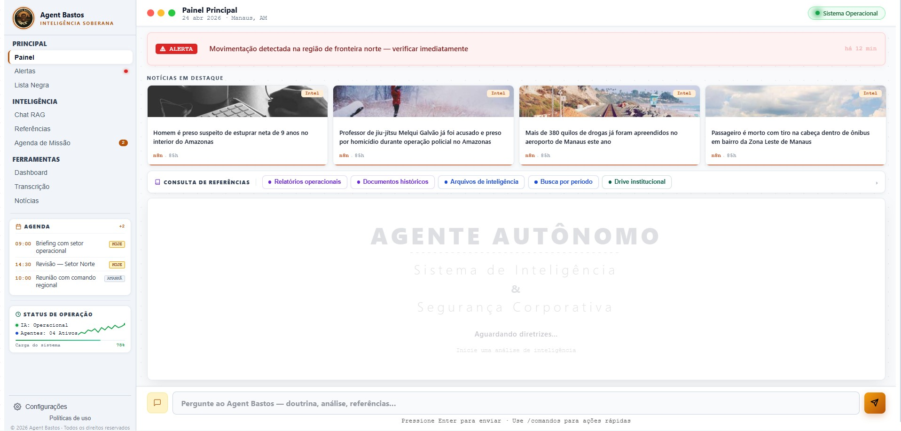
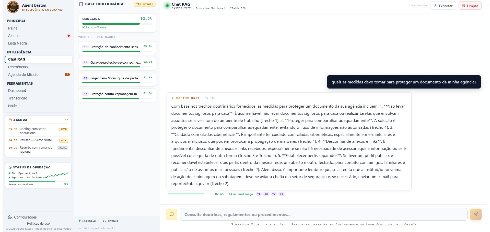
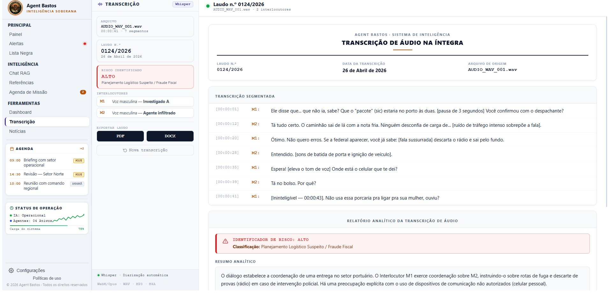
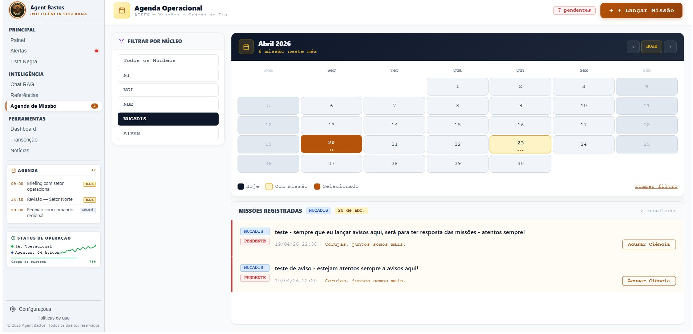
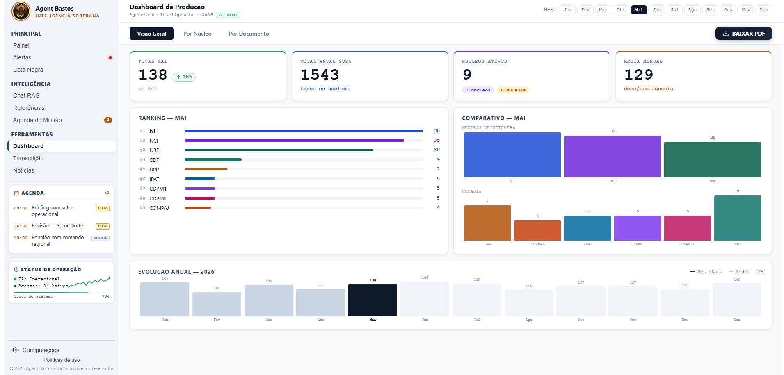
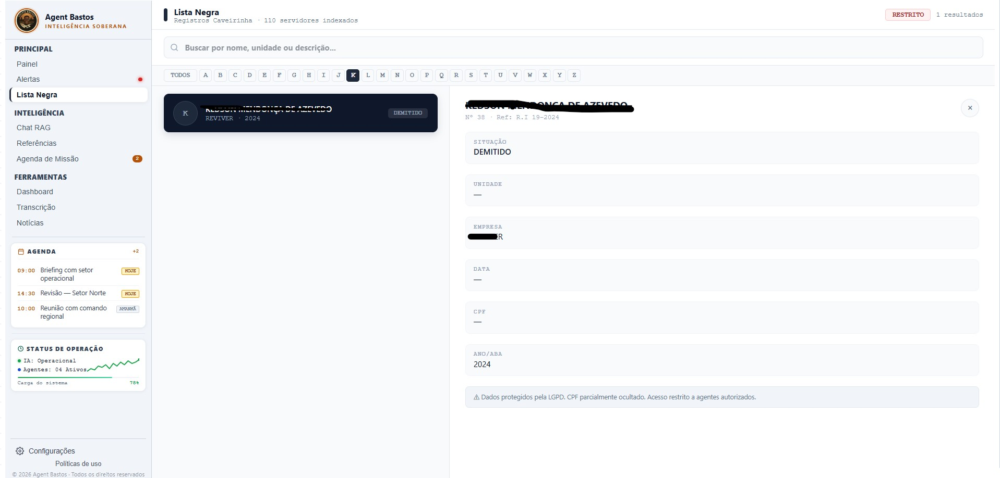

<div align="center">

[](https://github.com/patrese-procopio/agent-bastos/actions/workflows/ci.yml)
[](https://www.python.org/)
[](https://fastapi.tiangolo.com/)
[](https://www.docker.com/)
[](LICENSE)


```
  █████╗  ██████╗ ███████╗███╗   ██╗████████╗    ██████╗  █████╗ ███████╗████████╗ ██████╗ ███████╗
 ██╔══██╗██╔════╝ ██╔════╝████╗  ██║╚══██╔══╝    ██╔══██╗██╔══██╗██╔════╝╚══██╔══╝██╔═══██╗██╔════╝
 ███████║██║  ███╗█████╗  ██╔██╗ ██║   ██║       ██████╔╝███████║███████╗   ██║   ██║   ██║███████╗
 ██╔══██║██║   ██║██╔══╝  ██║╚██╗██║   ██║       ██╔══██╗██╔══██║╚════██║   ██║   ██║   ██║╚════██║
 ██║  ██║╚██████╔╝███████╗██║ ╚████║   ██║       ██████╔╝██║  ██║███████║   ██║   ╚██████╔╝███████║
 ╚═╝  ╚═╝ ╚═════╝ ╚══════╝╚═╝  ╚═══╝  ╚═╝       ╚═════╝ ╚═╝  ╚═╝╚══════╝  ╚═╝    ╚═════╝ ╚══════╝
```

### Sistema de Inteligência Corporativa com IA — Segurança Pública e Empresarial

<br/>

[](https://python.org)
[](https://fastapi.tiangolo.com)
[](https://react.dev)
[](https://trychroma.com)
[](https://groq.com)
[](https://ai.google.dev)
[](https://firebase.google.com)
[](https://www.gov.br/cidadania/lgpd)
[](https://docs.ragas.io)
[]()

<br/>

> **Plataforma de IA operacional** que transforma dado bruto em conhecimento acionável —
> combinando RAG doutrinário, análise forense de manuscritos, transcrição inteligente de áudio
> e dashboard de produção analítica em uma única interface integrada.

<br/>

[📖 Sobre o Projeto](#-sobre-o-projeto) • [🚀 Quick Start](#-quick-start-60-segundos) • [🏗️ Arquitetura](#️-arquitetura) • [📊 Resultados RAGAS](#-avaliação-de-qualidade--ragas) • [🗺️ Roadmap](#️-roadmap) • [📐 ADRs](./ARCHITECTURE.md)

</div>

---

## 🎯 O Problema que Resolve

Equipes de inteligência e segurança corporativa enfrentam gargalos críticos diariamente:

| Problema | Impacto Antes | Solução Agent Bastos |
|---|---|---|
| Consulta manual a doutrinas dispersas | 2–3h por analista/dia | RAG semântico com resposta em segundos |
| Transcrição manual de entrevistas e capturas | 45–90min por hora de áudio | Pipeline Whisper com RI gerado automaticamente |
| Análise de manuscritos e documentos físicos | Processo subjetivo e demorado | Análise grafoscópica com Gemini 2.5 Flash |
| Produção analítica sem visibilidade gerencial | Sem métricas, sem gestão | Dashboard com KPIs por núcleo e analista |

---

## 📋 Sobre o Projeto

O **Agent Bastos** é um sistema de inteligência corporativa com IA construído sobre uma década de experiência operacional em análise de segurança pública. A arquitetura foi desenhada para ser **agnóstica ao setor** — nasce em inteligência pública, mas é implantável em qualquer organização que produza conhecimento analítico: corporações, escritórios de compliance, unidades investigativas, agências regulatórias.

**Diferenciais técnicos:**

- **Zero alucinação verificada** — Faithfulness 1.000 no benchmark RAGAS, respostas fundamentadas exclusivamente no corpus doutrinário indexado
- **Multi-modelo orquestrado** — cada tarefa usa o modelo mais adequado (LLaMA 3.3 70B para RAG, Gemini 2.5 Flash para visão, Whisper para áudio)
- **Arquitetura modular** — cada módulo é independente, testável e substituível sem afetar o restante do sistema
- **LGPD by design** — dados operacionais nunca versionados, autenticação hierárquica, acervo acessado por referência

---

## ✨ Funcionalidades

<details>
<summary><strong>🔍 Consulta Doutrinária com RAG Vetorial</strong></summary>

Consulta semântica sobre bases de conhecimento e doutrinas corporativas via **ChromaDB + multilingual-e5-small**. O agente recupera os chunks mais relevantes por similaridade vetorial e responde fundamentado exclusivamente no conteúdo indexado.

- **Faithfulness 1.000** nos testes RAGAS — zero alucinação
- **Answer Relevancy 0.782** — alta aderência à pergunta
- Sempre referencia a origem do trecho recuperado
- Base de conhecimento atualizável sem rebuild do sistema

</details>

<details>
<summary><strong>🔬 Análise Grafoscópica de Manuscritos</strong></summary>

Upload de imagens de documentos físicos, bilhetes e registros apreendidos. O **Gemini 2.5 Flash** transcreve com precisão forense, preservando grafia original e identificando codinomes.

- Tratamento de cursivo denso e linguagem cifrada
- Sinalização de trechos duvidosos com marcadores de confiança
- Exportação em `.txt` e `.pdf` com cabeçalho de laudo forense
- Geração client-side via jsPDF — documento nunca sai do ambiente controlado

</details>

<details>
<summary><strong>🎙️ Transcrição Forense de Áudio</strong></summary>

Pipeline de transcrição via **Groq Whisper** com geração automática de Relatório de Informação (RI) no padrão institucional.

- Diarização de speakers com timestamps
- Identificação automática de flags de risco no conteúdo
- Geração do RI estruturado ao final da transcrição
- Suporte a gravação direta na interface ou upload de arquivo

</details>

<details>
<summary><strong>📊 Dashboard de Produção Analítica</strong></summary>

Painel gerencial de acompanhamento da produção por núcleo e por analista, com banco **SQLite** como source of truth local.

- KPIs com indicadores de tendência (▲▼)
- Gráficos de barras e linha por período
- Endpoint `/relatorio-dashboard` — relatório narrativo gerado por LLM
- Exportação de relatório gerencial em PDF

</details>

<details>
<summary><strong>🗓️ Agenda Operacional em Tempo Real</strong></summary>

Sistema de lançamento e acompanhamento de ordens e missões via **Firebase Firestore**.

- Sincronização em tempo real entre estações
- Acesso hierárquico com autenticação por hash SHA-256
- Notificação automática ao receber nova tarefa
- Histórico de missões por analista

</details>

<details>
<summary><strong>🗂️ Busca em Acervo Documental (Google Drive)</strong></summary>

Indexação e consulta do acervo histórico via **Google Drive API + OAuth2**, sem replicar documentos originais.

- Consulta por palavra-chave e semântica
- Acesso por referência — documentos originais não são copiados
- Ideal para referência cruzada e análise de produção histórica
- Filtro por tipo de documento e período

</details>

<details>
<summary><strong>🚨 Monitor de Alertas e Lista Negra</strong></summary>

Sistema de alertas operacionais integrado a workflows **n8n** com gestão de alvos.

- Feed de alertas em tempo real
- Lista negra de alvos com busca e gestão integrada
- Integração com feed de notícias via n8n
- Configurável por nível de criticidade

</details>

---

## 🏗️ Arquitetura

> 📐 **[Ver decisões arquiteturais completas (ARCHITECTURE.md)](./ARCHITECTURE.md)** — 10 ADRs documentados com contexto, trade-offs e resultados mensuráveis. Inclui timeline de evolução do projeto e benchmarks comparativos.

```
┌─────────────────────────────────────────────────────────────────────┐
│                         AGENT BASTOS v1.5                           │
├──────────────────┬──────────────────────┬───────────────────────────┤
│    FRONTEND      │      BACKEND         │    SERVIÇOS EXTERNOS      │
│  React 18 + Vite │  FastAPI + Python    │                           │
│                  │                      │  ┌──────────────────────┐ │
│  ┌────────────┐  │  ┌────────────────┐  │  │ Groq API             │ │
│  │  ChatRAG   │──┼─▶│    rag.py      │──┼─▶│ LLaMA 3.3 70B (RAG) │ │
│  └────────────┘  │  │ ChromaDB + e5  │  │  │ Whisper (áudio)      │ │
│                  │  └────────────────┘  │  └──────────────────────┘ │
│  ┌────────────┐  │  ┌────────────────┐  │                           │
│  │Grafoscopia │──┼─▶│  decifrar.py   │──┼─▶┌──────────────────────┐ │
│  └────────────┘  │  │  Vision + OCR  │  │  │ Gemini 2.5 Flash     │ │
│                  │  └────────────────┘  │  │ (visão computacional)│ │
│  ┌────────────┐  │  ┌────────────────┐  │  └──────────────────────┘ │
│  │Transcricao │──┼─▶│ transcricao.py │  │                           │
│  └────────────┘  │  │ Whisper + RI   │  │  ┌──────────────────────┐ │
│                  │  └────────────────┘  │  │ Firebase Firestore   │ │
│  ┌────────────┐  │  ┌────────────────┐  │  │ (agenda / real-time) │ │
│  │ Dashboard  │──┼─▶│  dashboard.py  │  │  └──────────────────────┘ │
│  └────────────┘  │  │  SQLite + KPIs │  │                           │
│                  │  └────────────────┘  │  ┌──────────────────────┐ │
│  ┌────────────┐  │  ┌────────────────┐  │  │ Google Drive API     │ │
│  │   Agenda   │──┼─▶│   agenda.py    │──┼─▶│ OAuth2 (acervo)      │ │
│  └────────────┘  │  └────────────────┘  │  └──────────────────────┘ │
│                  │  ┌────────────────┐  │                           │
│  ┌────────────┐  │  │   monitor.py   │──┼─▶┌──────────────────────┐ │
│  │  Alertas   │──┼─▶│  alertas + n8n │  │  │ n8n Workflows        │ │
│  │  Notícias  │  │  └────────────────┘  │  │ (automações / feeds) │ │
│  └────────────┘  │                      │  └──────────────────────┘ │
└──────────────────┴──────────────────────┴───────────────────────────┘
                                │
                    ┌───────────▼──────────┐
                    │      DATA LAYER      │
                    │  ChromaDB  (local)   │
                    │  SQLite    (local)   │
                    │  .env      (secrets) │
                    │  [nunca versionado]  │
                    └──────────────────────┘
```

### Estrutura do Repositório

```
agent-bastos/
│
├── api.py                   ← FastAPI — todas as rotas REST
├── main.py                  ← Entrypoint da aplicação
├── avaliar_rag.py           ← Pipeline RAGAS (benchmark de qualidade)
├── requirements.txt         ← Dependências Python
├── .env.example             ← Template de variáveis de ambiente
├── iniciar.bat              ← Sobe backend + n8n + frontend simultaneamente
│
├── modules/                 ← Lógica de negócio (desacoplada da API)
│   ├── rag.py               ← RAG vetorial — ChromaDB + LLaMA 3.3 70B
│   ├── decifrar.py          ← Análise grafoscópica — Gemini 2.5 Flash
│   ├── transcricao.py       ← Transcrição de áudio — Groq Whisper
│   ├── agenda.py            ← Agenda operacional — Firebase Firestore
│   ├── agente.py            ← Agente principal — orquestração LLM
│   ├── ingestor.py          ← Ingestão de documentos no ChromaDB
│   └── monitor.py           ← Monitor de alertas e eventos
│
├── drive_indexer/           ← Indexação do Google Drive (OAuth2)
│
├── frontend/                ← React 18 + Vite
│   └── src/
│       ├── App.jsx          ← Roteamento e sidebar de navegação
│       ├── ChatRAG.jsx      ← Interface do RAG doutrinário
│       ├── Grafoscopia.jsx  ← Análise grafoscópica de manuscritos
│       ├── Transcricao.jsx  ← Transcrição forense de áudio
│       ├── Dashboard.jsx    ← Dashboard de produção analítica
│       ├── Agenda.jsx       ← Agenda operacional
│       ├── Alertas.jsx      ← Monitor de alertas
│       ├── ListaNegra.jsx   ← Gestão de alvos
│       ├── Noticias.jsx     ← Feed de notícias integrado
│       ├── Referencias.jsx  ← Busca no acervo documental
│       └── Configuracoes.jsx
│
├── data/                    ← [não versionado — LGPD]
│   ├── doutrina/            ← Base de conhecimento (.txt)
│   ├── chroma_db/           ← Banco vetorial local
│   └── relatorios/          ← Laudos e relatórios gerados
│
└── docs/screenshots/        ← Capturas de tela do sistema
```

---

## 🛠️ Stack Tecnológica

| Camada | Tecnologia | Justificativa Técnica |
|---|---|---|
| **Backend** | FastAPI + Python 3.10+ | Performance assíncrona, tipagem forte, OpenAPI docs automáticas |
| **Frontend** | React 18 + Vite | SPA com HMR, build otimizado, componentização por domínio |
| **LLM / RAG** | LLaMA 3.3 70B via Groq | Melhor custo-benefício em Faithfulness — 1.000 nos testes RAGAS |
| **Visão Computacional** | Gemini 2.5 Flash | Superior em cursivo denso, linguagem cifrada e docs degradados |
| **Banco Vetorial** | ChromaDB + multilingual-e5-small | Busca semântica em português, persistência local, sem cloud obrigatória |
| **Transcrição** | Whisper via Groq API | Alta velocidade de inferência + diarização em português |
| **Tempo Real** | Firebase Firestore | Sync bidirecional em tempo real, sem infraestrutura própria |
| **Acervo** | Google Drive API (OAuth2) | Integração com acervo institucional existente sem replicação |
| **Automação** | n8n (self-hosted) | Workflows de alertas e integração com feeds externos |
| **Banco Analítico** | SQLite | Source of truth local para dashboard — zero dependência externa |
| **Avaliação RAG** | RAGAS | Benchmark objetivo: Faithfulness, Relevancy, Context Precision |
| **Exportação PDF** | jsPDF | Geração client-side — laudos nunca transitam por servidor externo |

---

## 🚀 Quick Start (60 segundos)

### Pré-requisitos

- Python 3.10+ · Node.js 18+
- Chaves de API: [Groq](https://console.groq.com) · [Google AI Studio](https://aistudio.google.com) · [Firebase](https://console.firebase.google.com)
- Credenciais OAuth2 do Google Drive

### 1. Clone e configure o backend

```bash
git clone https://github.com/patrese-procopio/agent-bastos.git
cd agent-bastos

python -m venv .venv
.venv\Scripts\activate        # Windows
# source .venv/bin/activate   # Linux/Mac

pip install -r requirements.txt
```

### 2. Variáveis de ambiente

```bash
cp .env.example .env
# Preencha com suas credenciais
```

```env
GROQ_API_KEY=gsk_...
GEMINI_API_KEY=AIzaSy...
GOOGLE_CREDENTIALS_PATH=credentials.json
CHROMA_DIR=data/chroma_db
DOUTRINA_DIR=data/doutrina
```

> ⚠️ Adicione na raiz: `credentials.json` (OAuth2 Google Drive) e `serviceAccountKey.json` (Firebase Admin SDK)

### 3. Frontend

```bash
cd frontend
npm install
npm run dev
```

### 4. Subida completa (Windows)

```bash
# Sobe backend + n8n + frontend simultaneamente
iniciar.bat
```

**Acesso:** `http://localhost:5173` · API Swagger: `http://localhost:8000/docs`

---

## 📊 Avaliação de Qualidade — RAGAS

Pipeline de benchmark objetivo e reproduzível do módulo RAG:

| Métrica | Score | Interpretação |
|---|---|---|
| **Faithfulness** | **1.000** ✅ | Respostas 100% fundamentadas no corpus — zero alucinação |
| **Answer Relevancy** | **0.782** ✅ | Alta aderência da resposta à pergunta formulada |
| **Context Precision** | **0.794** ✅ | Boa precisão na recuperação dos chunks mais relevantes |
| **Context Recall** | *em otimização* | Ajuste de chunking e overlap em andamento (meta: ≥ 0.850) |

```bash
# Reproduzir benchmark localmente
python avaliar_rag.py
```

> **Sobre Faithfulness = 1.000:** significa que nenhuma resposta do sistema contém informação ausente do corpus indexado. Avaliado via conjunto de perguntas com ground truth sobre a base doutrinária.

---

## 🔒 Segurança e LGPD

A conformidade com a LGPD não é um checklist — está na arquitetura:

```
PRINCÍPIO LGPD               IMPLEMENTAÇÃO TÉCNICA
──────────────────────────   ──────────────────────────────────────────────
Minimização de dados          Acervo acessado por referência, não replicado
Proteção de credenciais       .env isolado, jamais versionado (.gitignore)
Dados operacionais            *.jpeg, *.png, *.pdf operacionais fora do repo
Autenticação hierárquica      Senha em hash SHA-256 por nível de acesso
Geração de laudos forenses    jsPDF client-side — documento não transita
Auditabilidade                Arquitetura modular — auditoria por camada
Armazenamento controlado      ChromaDB e SQLite locais — sem cloud obrigatória
```

---

## 🖼️ Screenshots

| Painel Principal | Chat RAG Doutrinário |
|---|---|
|  |  |

| Transcrição Forense | Agenda Operacional |
|---|---|
|  |  |

| Dashboard de Produção | Alertas Operacionais |
|---|---|
|  |  |

---

## 🗺️ Roadmap

### ✅ v1.5 — MVP Atual

- [x] RAG vetorial com ChromaDB e benchmark RAGAS (Faithfulness 1.000)
- [x] Análise grafoscópica com Gemini 2.5 Flash
- [x] Transcrição forense com diarização e geração automática de RI
- [x] Dashboard de produção analítica com SQLite
- [x] Agenda operacional com Firebase Firestore em tempo real
- [x] Indexação de acervo via Google Drive API (OAuth2)
- [x] Interface React com 10 telas integradas
- [x] Exportação de laudos em PDF client-side
- [x] Drive institucional com fotos de lideranças por unidade
- [x] Arquitetura LGPD compliant

### 🔄 v2.0 — Em Desenvolvimento

- [ ] Autenticação individual por usuário (JWT + refresh token)
- [ ] Context Recall ≥ 0.850 via otimização de chunking
- [x] Testes automatizados (pytest — 44 testes, CI verde)
- [x] Dockerização completa (Dockerfile multi-stage + docker-compose)

### 🔮 v3.0 — Roadmap Futuro

- [ ] Suporte multi-organização (multi-tenant)
- [ ] Build desktop via Electron
- [ ] Versão mobile (React Native)
- [ ] Painel de auditoria e logs de acesso

---

## 🤝 Casos de Uso Corporativos

| Setor | Aplicação |
|---|---|
| **Segurança Corporativa** | Consulta de políticas, análise de incidentes, gestão de ocorrências |
| **Compliance e Jurídico** | Análise de manuscritos, transcrição de depoimentos, gestão de alvos |
| **Órgãos de Inteligência** | Acesso doutrinário, produção de relatórios, coordenação analítica |
| **RH e Investigação Interna** | Transcrição de entrevistas, análise de documentos físicos |
| **Capacitação Corporativa** | Consulta à base de conhecimento, produção de material analítico |

---

## 👤 Autor

<div align="center">

**Patrese Procopio**
*Especialista em Inteligência de Segurança · Engenharia de Dados com foco em IA*

Uma década de experiência operacional em análise de inteligência —
aplicada ao desenvolvimento de sistemas que transformam dado bruto em conhecimento acionável.

[](https://linkedin.com/in/patrese-procopio)
[](https://github.com/patrese-procopio)

</div>

---

<div align="center">
<sub>Agent Bastos — construído com experiência operacional real, para problemas reais.</sub>
</div>
