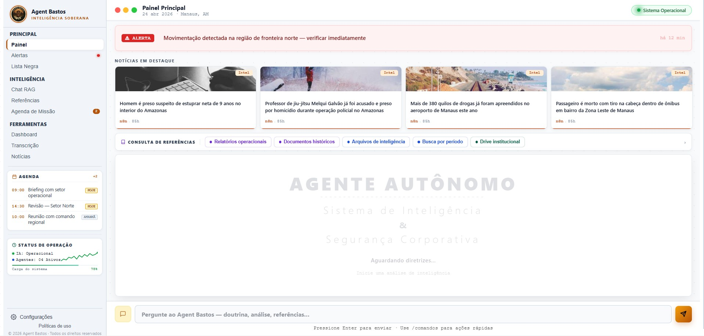
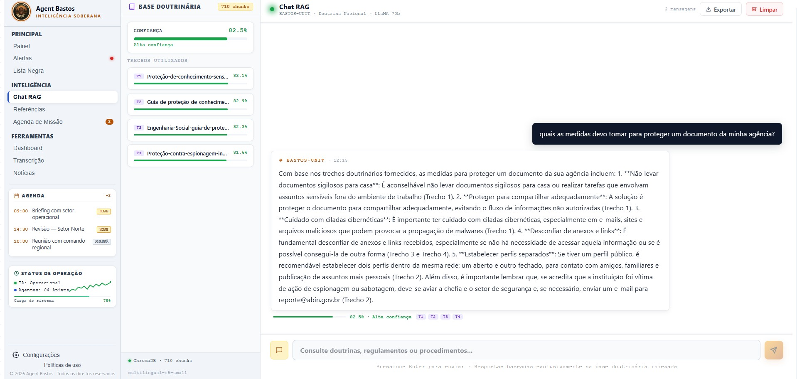
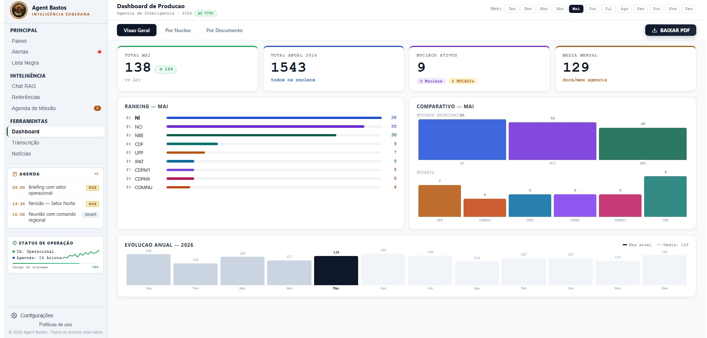
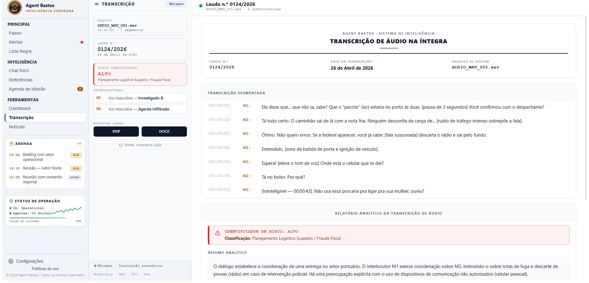
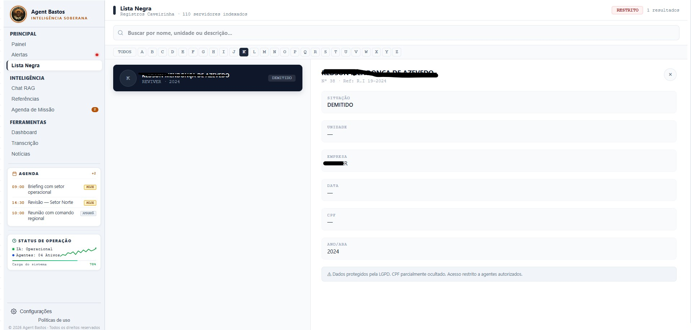
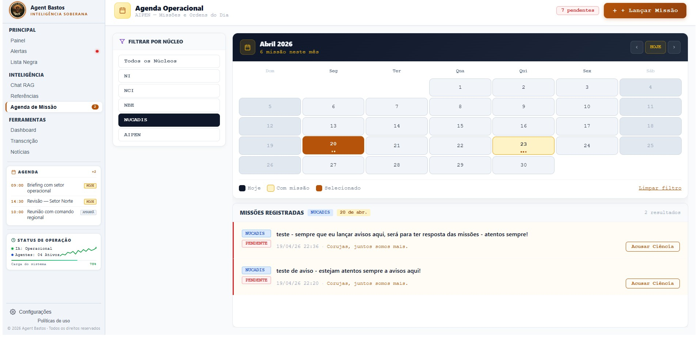

<div align="center">

# 🛡️ Agent Bastos

### Plataforma de Inteligência Operacional para Segurança Pública e Sistema Penitenciário

*RAG sobre doutrina · OSINT e alertas · análise de vínculos · transcrição forense · operações com drone — em um único sistema, com segurança e rastreabilidade de ponta a ponta.*

<br>


[](https://github.com/patrese-procopio/agent-bastos/actions/workflows/ci.yml)


<br>



</div>

---

## 📑 Sumário

1. [Visão geral](#-visão-geral)
2. [Mapa de módulos](#-mapa-de-módulos)
3. [Arquitetura](#-arquitetura)
4. [IA e provedores de LLM](#-ia-e-provedores-de-llm)
5. [Automação (n8n)](#-automação-n8n)
6. [Segurança e conformidade](#-segurança-e-conformidade)
7. [Stack tecnológica](#-stack-tecnológica)
8. [Como executar](#-como-executar)
9. [Configuração](#-configuração)
10. [Implantação (servidor central)](#-implantação-servidor-central)
11. [Estrutura do repositório](#-estrutura-do-repositório)
12. [Testes e qualidade](#-testes-e-qualidade)
13. [Documentação complementar](#-documentação-complementar)
14. [Roadmap](#-roadmap)
15. [Autor e licença](#-autor-e-licença)

---

## 🎯 Visão geral

**Agent Bastos** reúne, em uma só plataforma, as ferramentas que um analista de inteligência usa no dia a dia: consulta a doutrina e documentos, monitoramento de alvos em fontes abertas, mapeamento de vínculos entre pessoas e organizações, transcrição de áudios, leitura de manuscritos, gestão de lideranças por unidade e planejamento de operações com drone.

Três princípios guiam o projeto:

| Princípio | Como aparece no sistema |
|---|---|
| **A IA propõe, o analista decide** | Fusão de homônimos só por confirmação manual; alertas de risco alto abrem uma aprovação humana (*Human-in-the-Loop*); toda extração traz a **proveniência** do trecho que a originou. |
| **Soberania de dados** | Roteamento por classificação: dado sensível **nunca** vai para nuvem — só para modelo local (Ollama). Se o modelo local estiver indisponível, o sistema recusa em vez de vazar. |
| **Rastreabilidade** | Logs estruturados em JSON, auditoria com encadeamento de hash (*tamper-evident*) e trilha forense de operações sensíveis. |

> ⚠️ **Privacidade:** este repositório não contém dados operacionais, bases de pessoas, credenciais ou documentos sigilosos. A pasta `data/`, chaves e arquivos de alvos são ignorados pelo Git. Os exemplos usam dados fictícios.

---

## 🧭 Mapa de módulos

O menu do aplicativo é dividido em três grupos. Cada item é protegido por um **módulo de permissão** no token JWT — o usuário só vê (e só acessa na API) o que lhe foi concedido.

### Principal

| Tela | O que faz | Permissão |
|---|---|---|
| **Painel** | Visão consolidada da operação e atalhos. | — |
| **Alertas** | Monitoramento de alvos e termos em três frentes — notícias em tempo real (GDELT), OSINT estendido (90 dias) e canais públicos do Telegram. Cada achado recebe **análise tática por IA** e classificação de risco; cadastro de alvos/variantes pela própria tela; marcação de lidos. | `alertas`, `osint` |
| **ORÁCULO** | Painel de *Human-in-the-Loop*: aprovações pendentes geradas por alertas e transcrições de risco alto, com notificação por WhatsApp. | `hitl` |
| **Controle de Grupos** | Ocupação de grupos/facções por unidade e pavilhão, com histórico **mensal** (o mês novo copia o anterior). Inclui a aba **Inteligência de Grupos**: ranking, grupo dominante, evolução e variações. | `grupos` |
| **Lideranças por Unidade** | Cadastro e visualização de lideranças por pavilhão/ala em cartões-dossiê, com foto, competência mensal e exportação em PDF. Inclui a visão **Líderes Gerais**. | `liderancas` |
| **Análise de Vínculo** | Motor de grafo de vínculos estilo *i2* dentro do app: visão por alvo, 12 tipos de nó, galeria com ~250 ícones, criação manual de nós/vínculos, foto em qualquer nó, linha do tempo de movimentações, scanner de citações em documentos e **fusão de homônimos** sob confirmação. | `vinculo` |
| **Extrato** | Recebe extratos de campo desestruturados, extrai entidades e relações via LLM com **proveniência** (trecho literal), aplica piso de risco por palavra crítica e alimenta o grafo e o léxico. Gera o **RAE** (Relatório Analítico de Extrato) em PDF. | `extrato` |
| **Lista Negra** | Consulta de registros restritivos com painel de detalhe. | `lista_negra` |

### Inteligência

| Tela | O que faz | Permissão |
|---|---|---|
| **Chat RAG** | Perguntas em linguagem natural sobre a base documental, com busca **híbrida** (vetorial + palavra-chave) e memória de conversa criptografada. | `chat_rag` |
| **OSINT Pessoas** | Pesquisa em fontes abertas e bases públicas (Receita/CNPJ, sanções CGU, TSE, DJEN, Diários Oficiais, DataJud), com *gate* de LGPD e relatório em PDF. | `osint` |
| **Inteligência Preditiva** | **Sinais Fracos**: léxico de jargões que evolui de *candidato* → *validado*/*rejeitado* e realimenta os prompts. **Matriz NUCADIs**: mapa de calor por unidade (volume, risco ou combinado) com selo de integridade da auditoria. | `sinais_fracos`, `matrix_nucadis` |
| **Referências** | Busca nos documentos indexados do Google Drive (crawler, parser e indexador próprios). | `referencias` |
| **Agenda de Missão** | CRUD de missões com sincronização no Firebase. | `agenda` |

### Ferramentas

| Tela | O que faz | Permissão |
|---|---|---|
| **Dashboard** | Produção documental real (SQLite): KPIs, ranking por núcleo, por tipo, evolução mensal e lançamento de documentos. | `dashboard` |
| **Transcrição** | Áudio → texto (Whisper) → laudo estruturado com falantes, linha do tempo, classificação de risco e *red flags*; exporta TXT, PDF e DOCX. Risco alto abre aprovação HITL e dispara o cruzamento com alvos e lideranças. | `transcricao` |
| **Acervo de Áudios** | Extrator em lote: fila de gravações (upload múltiplo ou pasta monitorada), áudios longos cortados em pausas de fala, transcrição com tempo, **busca em texto integral**, player sincronizado com a transcrição, correção humana (original preservado), laudo e **cadeia de custódia** (SHA-256 do original + trilha com hash encadeado). Material sensível **nunca** vai para a nuvem: sem transcrição local, fica bloqueado. | `transcricao` |
| **Análise Grafoscópica** | Transcrição forense e parecer de manuscritos (bilhetes, cartas, códigos) via visão computacional. | `grafoscopia` |
| **Notícias** | Feed de crimes e ocorrências, atualizado por automação. | `noticias` |
| **Operações Drone** | Missões, importação e upload de mídias com trajeto, **ortomosaico** (GeoTIFF), comparação temporal de imagens/mosaicos com mapa de calor e relatório da missão. | `drone` |

Há ainda **Gerenciar Usuários**, **Auditoria**, **Configurações** (inclusive chaves de API mascaradas) e o **briefing diário (BDI)** em PDF.

<div align="center">

| Chat RAG | Dashboard |
|:---:|:---:|
|  |  |
| **Transcrição** | **Alertas** |
|  |  |
| **Agenda** | **Notícias** |
|  |  |

</div>

---

## 🏗️ Arquitetura

```
┌──────────────────────────────────────────────────────────────────────┐
│            Cliente desktop — Electron + React (Vite)                  │
│   URL do backend configurável (assistente no 1º boot) · CSP dinâmica  │
└───────────────────────────────┬──────────────────────────────────────┘
                                │ HTTPS (Caddy) + JWT Bearer
┌───────────────────────────────▼──────────────────────────────────────┐
│                        API — FastAPI (/api)                           │
│  Middlewares: SecurityHeaders · AccessLog · CORS (allowlist) · RateLimit
│  Auth: JWT + refresh rotativo · bcrypt · blacklist  │  RBAC por módulo│
│                                                                       │
│  routers/  (HTTP) ──► services/ (negócio) ──► modules/ (capacidades)  │
└───┬───────────┬───────────┬────────────┬───────────────┬─────────────┘
    │           │           │            │               │
┌───▼────┐ ┌────▼────┐ ┌────▼─────┐ ┌────▼──────┐ ┌──────▼───────┐
│ChromaDB│ │ SQLite  │ │Firestore │ │ Google    │ │  n8n + Evol. │
│vetorial│ │por domí-│ │(alertas, │ │ Drive     │ │  (agendador, │
│  RAG   │ │nio (6+) │ │ agenda)  │ │ (indexer) │ │   WhatsApp)  │
└────────┘ └─────────┘ └──────────┘ └───────────┘ └──────────────┘
```

**Camadas**

- `routers/` — somente transporte HTTP (validação, status, permissões).
- `services/` — regras de negócio e persistência (auth, alertas, grupos, drone, logging, rate limit, escopo).
- `modules/` — capacidades de IA e análise (RAG, extração, grafo, léxico, monitores OSINT, decifração).

**Persistência por domínio.** Em vez de um banco monolítico, cada domínio tem seu SQLite (usuários e blacklist, dashboard, lideranças, grupos, grafo de vínculos, extrato e auditoria, drone). O conhecimento documental fica em ChromaDB; alertas e agenda usam Firestore com **fallback em JSON local**, de modo que a tela continua funcionando offline.

**Decisões de arquitetura** estão registradas como ADRs em [`ARCHITECTURE.md`](./ARCHITECTURE.md) (separação backend/frontend, ChromaDB, FastAPI, modularização, migração de LLM, *chunking*, avaliação RAGAS e outras).

---

## 🤖 IA e provedores de LLM

| Uso | Provedor / modelo |
|---|---|
| Chat RAG, análise tática de alertas, laudo de transcrição | Groq — Llama 3.3 70B |
| Transcrição de áudio | Groq — Whisper Large v3 Turbo |
| Extração de entidades do **Extrato** (RAE) | **Plugável**: Claude (Anthropic), Groq, DeepSeek ou **Ollama local** — escolhido por `EXTRATO_PROVIDER` |
| Grafoscopia (manuscritos) | Google Gemini 2.5 Flash (visão) |
| Embeddings do RAG | Modelo multilíngue local (sentence-transformers) |

**Guardrail de classificação.** Cada extrato recebe uma classificação (*teste*, *público*, *reservado*, *sigiloso*…). Classificações sensíveis são forçadas para o provedor **local**; se ele estiver indisponível, a requisição é recusada — o dado não sai da máquina.

**Qualidade do RAG.** Busca híbrida (vetorial + palavra-chave) e pipeline de avaliação **RAGAS** (`scripts/avaliar_rag.py`).

---

## ⚙️ Automação (n8n)

Os fluxos ficam em [`automacao_n8n/`](./automacao_n8n) e [`n8n_workflows/`](./n8n_workflows) e chamam a API com um **token de agendador** (`X-Agendador-Token`) restrito às rotas de varredura — nenhum fluxo guarda senha de usuário.

| Workflow | Frequência | Função |
|---|---|---|
| Monitor de Alertas | 8 h | Varreduras Tempo Real + OSINT + Telegram |
| Monitor de Crimes (Notícias) | Diária | Atualiza o feed de notícias |
| Sync do Drive | Diária, 03h | Reindexa os documentos do Google Drive |
| Atualização de bases OSINT | Diária, 03h30 | Recarrega bases públicas se houver dado novo |
| Extrator de Áudio | 5 min | Enfileira no Acervo os áudios novos de `data/audios` (o worker transcreve em segundo plano) e move o arquivo para `processados/` |
| BDI — Boletim Diário | Diária | Gera o briefing em PDF |
| Human-in-the-Loop (WhatsApp) | Evento | Notifica aprovações pendentes via Evolution API |
| Extrato (webhook) | Evento | Recebe extrato, processa e alerta se risco ≥ 8 |

---

## 🔐 Segurança e conformidade

### Autenticação e autorização
- **JWT** de curta duração (15 min) com **refresh rotativo**; tokens revogados ficam em *blacklist* persistente (hash SHA-256).
- **RBAC por módulo** (`require_module`): princípio do menor privilégio em cada rota.
- **Senhas com bcrypt**; bloqueio temporário após falhas de login.
- **Token de agendador** dedicado para automações, válido só nas rotas de varredura.

### Proteção da aplicação
- **Rate limiting** (slowapi) por perfil de custo: login, varreduras, reindexação, IA pesada/leve e escritas.
- **Security headers** (`nosniff`, `X-Frame-Options`, `Referrer-Policy`, `Permissions-Policy`, `Cross-Origin-*`).
- **CORS por allowlist**, configurável por ambiente (`BASTOS_CORS_ORIGINS`).
- **Escopo por autor** (`scoping_service`): não-administradores só enxergam os próprios registros; recurso alheio responde 404, sem revelar existência.
- **Sanitização** de nomes de arquivo, validação de **magic bytes** em uploads e limites de tamanho.
- **Fail-fast**: o sistema não inicia sem chaves críticas configuradas.

### Dados, logs e auditoria
- **Logging estruturado** (JSON-lines) com rotação e *redaction* automática de campos sensíveis; logs separados de aplicação, erro, acesso e auditoria.
- **Auditoria com hash-chain** SHA-256 (*tamper-evident*) nas operações do módulo Extrato.
- **Conversas do chat** criptografadas em repouso (Fernet).
- **LGPD**: *gate* de finalidade no OSINT, minimização de dados e checklist de conformidade em [`DEPLOY_AGENCIA.md`](./DEPLOY_AGENCIA.md).

> 📑 A auditoria de segurança, com correções e análise de severidade, está em [`AUDIT.md`](./AUDIT.md).

---

## 🛠️ Stack tecnológica

**Backend** — Python 3.14 · FastAPI · Uvicorn · Pydantic · slowapi · python-jose · bcrypt · cryptography
**Dados** — SQLite (por domínio) · ChromaDB · Firebase Firestore · Google Drive API
**IA** — Groq (Llama 3.3 70B, Whisper) · Anthropic Claude · Google Gemini · Ollama · sentence-transformers · RAGAS
**OSINT** — GDELT · Telethon (Telegram) · DataJud · Receita/CNPJ · CGU · TSE · DJEN · Querido Diário
**Geoespacial / mídia** — processamento de imagens de drone, ortomosaico e GeoTIFF
**Frontend** — React · Vite · Electron · react-force-graph-2d · Recharts
**Infra** — Docker Compose · Caddy (HTTPS automático) · n8n · Evolution API · GitHub Actions

---

## 🚀 Como executar

> **Pré-requisitos:** Python 3.12+ (testado em 3.14), Node.js 18+, chave de API de ao menos um provedor de LLM (Groq recomendado).

### 1. Backend

```bash
git clone https://github.com/patrese-procopio/agent-bastos.git
cd agent-bastos

python -m venv .venv
source .venv/bin/activate          # Linux/Mac
# .venv\Scripts\Activate.ps1       # Windows PowerShell

pip install -r requirements.txt

cp .env.example .env               # preencha as chaves (veja "Configuração")

python -m modules.ingestor         # indexa a base documental (RAG)
python api.py                      # API em http://127.0.0.1:8000
```

### 2. Frontend (Electron + React)

O cliente desktop vive no repositório do aplicativo (branch `master` deste mesmo remoto):

```bash
cd agent-bastos-app
npm install
npm run dev          # interface web de desenvolvimento (Vite)
npm run start        # Vite + Electron
npm run dist         # gera o instalador Windows (NSIS)
```

No primeiro boot, o assistente de configuração pede a **URL do backend** e testa a conexão.

### 3. Atalho no Windows

`iniciar.bat` sobe backend, n8n e interface, aguardando cada serviço responder antes de abrir o navegador.

---

## 🔧 Configuração

Todas as configurações sensíveis vêm de variáveis de ambiente (`.env`, **nunca versionado**). O arquivo [`.env.example`](./.env.example) documenta cada uma.

| Grupo | Variáveis principais |
|---|---|
| Segurança | `JWT_SECRET_KEY`, `FERNET_KEY`, `*_PASSWORD_HASH`, `BASTOS_AGENDADOR_TOKEN` |
| LLM | `GROQ_API_KEY`, `GEMINI_API_KEY`, `ANTHROPIC_API_KEY`, `EXTRATO_PROVIDER`, `OLLAMA_MODEL` |
| Telegram OSINT | `TELEGRAM_API_ID`, `TELEGRAM_API_HASH`, `TELEGRAM_SESSION` |
| Monitoramento | `WATCHLIST_ATIVO`, `WATCHLIST_INTERVALO_HORAS`, `WATCHLIST_JANELA_DIAS` |
| HITL / n8n | `N8N_WEBHOOK_HITL`, `HITL_CALLBACK_KEY`, `N8N_ENCRYPTION_KEY` |
| Rede (deploy) | `BASTOS_BIND_ADDR`, `BASTOS_CORS_ORIGINS`, `BASTOS_CORS_ORIGIN_REGEX` |

Gerar segredos e senhas:

```bash
python -c "import secrets; print(secrets.token_hex(48))"          # JWT_SECRET_KEY
python -c "from cryptography.fernet import Fernet; print(Fernet.generate_key().decode())"
python scripts/setar_senha.py <usuario>                           # hash bcrypt
```

Chaves de API também podem ser gerenciadas pela tela **Configurações** (valores mascarados, gravados no `.env` e aplicados em tempo de execução).

---

## 🏢 Implantação (servidor central)

Modelo suportado: **1 servidor Docker + N clientes Electron**.

```bash
# API + n8n + Evolution API
docker compose up -d

# Com HTTPS automático (Caddy na frente)
docker compose -f docker-compose.yml -f docker-compose.caddy.yml up -d
```

- Portas ligadas a `127.0.0.1` por padrão; abra para a rede via `BASTOS_BIND_ADDR`.
- O cliente Electron lê a URL do servidor de um arquivo de configuração por usuário (ou variável de ambiente para GPO/MDM).
- Passo a passo completo para a equipe de TI, com *troubleshooting* e checklist LGPD: [`DEPLOY_AGENCIA.md`](./DEPLOY_AGENCIA.md).
- Procedimento do WhatsApp/HITL: [`docs/HITL_SETUP.md`](./docs/HITL_SETUP.md).

---

## 📂 Estrutura do repositório

```
agent-bastos/
├── api.py                  # Entry point: middlewares, routers, lifespan
├── dependencies.py         # Autenticação, RBAC, token de agendador
├── config/                 # Configurações e caminhos centralizados
├── routers/                # Camada HTTP — ~25 routers por domínio
├── services/               # Regras de negócio (auth, alertas, grupos, drone,
│                           #   logging, rate limit, escopo, notificações…)
├── modules/
│   ├── rag.py · hybrid_retriever.py · ingestor.py   # RAG
│   ├── extrato.py · lexico.py · grafo.py            # Extrato, sinais fracos, vínculos
│   ├── monitor.py · telegram_monitor.py             # Varreduras de alertas
│   ├── decifrar.py                                  # Grafoscopia
│   └── osint/                                       # Coletores e bases públicas
├── drive_indexer/          # Crawler, parser e indexador do Google Drive
├── automacao_n8n/          # Workflows de automação (importáveis)
├── n8n_workflows/          # BDI e demais fluxos
├── scripts/                # Manutenção: índices, backup, avaliação do RAG, senhas
├── tests/                  # Suíte pytest
├── docs/                   # Capturas de tela, demos e guias
├── Dockerfile · docker-compose*.yml · Caddyfile
├── ARCHITECTURE.md         # ADRs
├── AUDIT.md                # Auditoria de segurança
└── DEPLOY_AGENCIA.md       # Guia de implantação
```

---

## ✅ Testes e qualidade

```bash
pip install -r requirements-dev.txt
pytest                      # 98 testes
python scripts/avaliar_rag.py   # avaliação RAGAS do RAG
```

- Testes cobrem serviços de alertas, exportação, drone (serviço, comparação, mosaico, relatório), autenticação, backup e outros.
- CI no GitHub Actions a cada *push* e *pull request* na `main`.
- `scripts/_inspect_dbs.py` e `scripts/aplicar_indices.py` auditam e otimizam os planos de consulta dos bancos SQLite.

---

## 📚 Documentação complementar

| Documento | Conteúdo |
|---|---|
| [`ARCHITECTURE.md`](./ARCHITECTURE.md) | Registros de decisão de arquitetura (ADRs) |
| [`AUDIT.md`](./AUDIT.md) | Auditoria de segurança e conformidade LGPD |
| [`DEPLOY_AGENCIA.md`](./DEPLOY_AGENCIA.md) | Implantação em servidor central, passo a passo |
| [`docs/HITL_SETUP.md`](./docs/HITL_SETUP.md) | Configuração do fluxo Human-in-the-Loop |
| [`PROXIMAS_MISSOES.md`](./PROXIMAS_MISSOES.md) | Backlog e próximos passos |

---

## 🗺️ Roadmap

- [x] Auditoria de segurança e hardening (rate limit, headers, CORS, logs estruturados)
- [x] RBAC por módulo e gestão de usuários
- [x] RAG com busca híbrida e avaliação RAGAS
- [x] Alertas multifonte com análise de IA e automação via n8n
- [x] Análise de vínculos, Extrato/RAE e sinais fracos
- [x] Operações com drone (ortomosaico, comparação temporal, relatório)
- [x] Human-in-the-Loop com WhatsApp
- [x] Containerização, HTTPS e cliente Electron configurável
- [x] CI com GitHub Actions
- [ ] Modelo local de maior capacidade (GPU) para extração sensível
- [ ] Busca de perfis por *username* (Sherlock/Maigret)
- [ ] Persistência global do layout do grafo e mescla assistida de duplicatas
- [ ] Ampliação da cobertura de testes (frontend e integração)

---

## 👤 Autor e licença

**Patrese Procópio** — Engenharia de Dados · Inteligência de Segurança · Soluções de IA Corporativa
[](https://github.com/patrese-procopio)

Software de **uso restrito**: disponibilizado para demonstração e portfólio. Para outros usos, consulte o autor.

<div align="center">

---

*Construído com atenção à segurança, à privacidade e à boa engenharia.*

</div>
